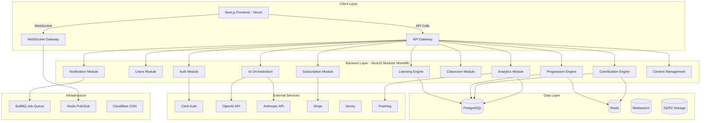
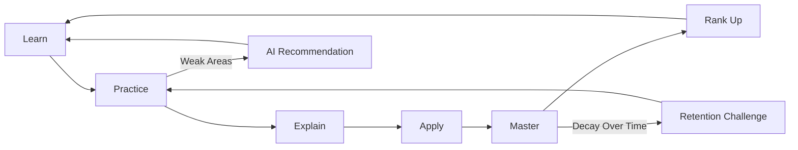

# Teaching Platform — Architecture Overview

## Platform Identity

**Codename:** Nexus Learning Platform  
**Category:** Next-Generation Gamified Mastery-Based Learning System  
**Philosophy:** Learn → Practice → Explain → Apply → Master → Rank Up

---

## System Architecture Diagram



---

## Tech Stack Summary

| Layer | Technology | Purpose |
|-------|-----------|---------|
| Frontend | Next.js 14+ App Router | UI, SSR, RSC |
| UI Framework | Tailwind CSS + Shadcn UI | Component system |
| Animation | Framer Motion | Transitions, gamification effects |
| State | Zustand + React Query | Client state + server cache |
| Backend | NestJS | API, business logic |
| ORM | Prisma | Database access |
| Database | PostgreSQL | Primary data store |
| Cache | Redis | Caching, realtime, leaderboards |
| Search | Meilisearch | Content search |
| Auth | Clerk | Authentication |
| AI | OpenAI + Anthropic | Tutoring, adaptive learning |
| Queue | BullMQ | Background jobs |
| Storage | Cloudflare R2 | Files, media |
| Monitoring | Sentry + PostHog | Errors + product analytics |
| Payments | Stripe | Subscriptions |
| Deployment | Vercel + AWS ECS | Frontend + Backend |

---

## Monorepo Structure

```
teaching_platform/
├── apps/
│   ├── web/                    # Next.js frontend
│   └── api/                    # NestJS backend
├── packages/
│   ├── shared/                 # Shared types, constants, utils
│   ├── ui/                     # Shared UI components (design system)
│   ├── database/               # Prisma schema + migrations
│   └── config/                 # Shared configs (eslint, tsconfig)
├── docker/                     # Docker configs
├── docs/                       # Documentation
├── plans/                      # Architecture plans
├── turbo.json                  # Turborepo config
├── package.json                # Root package.json
└── pnpm-workspace.yaml         # Workspace config
```

---

## Role-Based Access Matrix

| Feature | Student | Teacher | School Admin | Super Admin |
|---------|---------|---------|--------------|-------------|
| Learning lessons | ✅ | ❌ | ❌ | ❌ |
| Skill tree | ✅ | View only | View only | View only |
| AI Tutor | ✅ | ❌ | ❌ | ❌ |
| Gamification | ✅ | ❌ | ❌ | ❌ |
| Create classrooms | ❌ | ✅ | ✅ | ✅ |
| Assign work | ❌ | ✅ | ✅ | ✅ |
| Student analytics | Own only | Class | School | All |
| Manage teachers | ❌ | ❌ | ✅ | ✅ |
| Content management | ❌ | Limited | ❌ | ✅ |
| Subscriptions | ❌ | ❌ | ✅ | ✅ |
| System config | ❌ | ❌ | ❌ | ✅ |

---

## Core Learning Loop



---

## Development Phases

### Phase 1 — MVP Foundation
- Auth + Onboarding
- Student Dashboard
- Lesson System (Math)
- Quiz Engine
- Skill Tree v1
- XP + Streaks + Ranks
- AI Tutor (basic)
- Teacher Classrooms
- Basic Content Management

### Phase 2 — Engagement
- Boss Battles
- Daily Quests
- Leaderboards
- Advanced AI Tutor
- Retention System
- Weak-Area Engine
- Teacher Analytics
- Assignments v2

### Phase 3 — Scale
- More Subjects
- School Admin Dashboard
- Subscription System
- Advanced Analytics
- Seasonal Systems
- Achievement System
- Discussion Forums

### Phase 4 — Premium
- PvP Systems
- Collaborative Features
- Mobile Apps
- Enterprise Features
- Advanced AI Workspace
- Recommendation Engine v2

---

## Key Design Principles

1. **Mastery over Completion** — Never progress without proving understanding
2. **Retention over Memorization** — Spaced repetition and decay systems
3. **Application over Passive Learning** — Interactive exercises, not videos
4. **Performance-Based Progression** — XP from accuracy, not attendance
5. **Modular Architecture** — Each domain cleanly separated
6. **Scale-Ready Foundations** — Build for 100K users from day one
7. **AI-Native** — AI deeply integrated, not bolted on
8. **Game-Feel** — Every interaction should feel rewarding

---

## Next Documents

- [01-frontend-architecture.md](./01-frontend-architecture.md) — Routes, layouts, components
- [02-backend-architecture.md](./02-backend-architecture.md) — NestJS modules, services
- [03-database-schema.md](./03-database-schema.md) — PostgreSQL schema design
- [04-gamification-system.md](./04-gamification-system.md) — XP, ranks, progression
- [05-ai-system.md](./05-ai-system.md) — AI abstraction, tutoring
- [06-learning-engine.md](./06-learning-engine.md) — Lessons, quizzes, mastery
- [07-api-design.md](./07-api-design.md) — REST endpoints, WebSocket events
- [08-ui-design-system.md](./08-ui-design-system.md) — Components, tokens, motion
