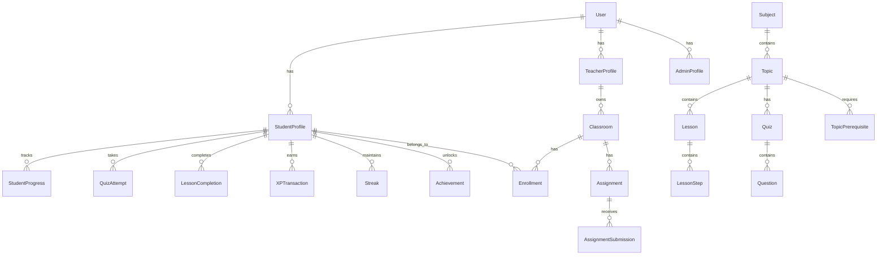

# Database Schema Design — PostgreSQL + Prisma

## Entity Relationship Diagram



---

## Schema Definition

### Core User Models

```prisma
// ==================== USER & AUTH ====================

model User {
  id            String          @id @default(cuid())
  clerkId       String          @unique
  email         String          @unique
  firstName     String
  lastName      String
  avatarUrl     String?
  role          UserRole        @default(STUDENT)
  isActive      Boolean         @default(true)
  createdAt     DateTime        @default(now())
  updatedAt     DateTime        @updatedAt

  studentProfile  StudentProfile?
  teacherProfile  TeacherProfile?
  adminProfile    AdminProfile?
  notifications   Notification[]

  @@index([clerkId])
  @@index([email])
  @@index([role])
}

enum UserRole {
  STUDENT
  TEACHER
  SCHOOL_ADMIN
  SUPER_ADMIN
}

model StudentProfile {
  id            String          @id @default(cuid())
  userId        String          @unique
  user          User            @relation(fields: [userId], references: [id])
  
  // Gamification State
  totalXp       Int             @default(0)
  level         Int             @default(1)
  rankId        String?
  rank          Rank?           @relation(fields: [rankId], references: [id])
  
  // Preferences
  gradeLevel    Int?
  subjects      String[]        // Selected subjects
  dailyGoal     Int             @default(30) // minutes
  timezone      String          @default("UTC")
  
  // Onboarding
  onboardingComplete Boolean    @default(false)
  diagnosticComplete Boolean    @default(false)
  
  createdAt     DateTime        @default(now())
  updatedAt     DateTime        @updatedAt

  // Relations
  progress      StudentProgress[]
  xpTransactions XPTransaction[]
  streak        Streak?
  achievements  StudentAchievement[]
  quizAttempts  QuizAttempt[]
  lessonCompletions LessonCompletion[]
  enrollments   Enrollment[]
  tutorSessions TutorSession[]
  questProgress QuestProgress[]
  retentionData RetentionRecord[]

  @@index([userId])
  @@index([totalXp])
  @@index([rankId])
}

model TeacherProfile {
  id            String          @id @default(cuid())
  userId        String          @unique
  user          User            @relation(fields: [userId], references: [id])
  
  schoolId      String?
  school        School?         @relation(fields: [schoolId], references: [id])
  subjects      String[]
  bio           String?
  
  createdAt     DateTime        @default(now())
  updatedAt     DateTime        @updatedAt

  classrooms    Classroom[]

  @@index([userId])
  @@index([schoolId])
}

model AdminProfile {
  id            String          @id @default(cuid())
  userId        String          @unique
  user          User            @relation(fields: [userId], references: [id])
  
  schoolId      String?
  school        School?         @relation(fields: [schoolId], references: [id])
  adminLevel    AdminLevel      @default(SCHOOL)
  
  createdAt     DateTime        @default(now())
  updatedAt     DateTime        @updatedAt

  @@index([userId])
  @@index([schoolId])
}

enum AdminLevel {
  SCHOOL
  DISTRICT
  SUPER
}

model School {
  id            String          @id @default(cuid())
  name          String
  slug          String          @unique
  domain        String?
  logoUrl       String?
  address       String?
  city          String?
  state         String?
  country       String?
  
  planId        String?
  plan          SubscriptionPlan? @relation(fields: [planId], references: [id])
  
  isActive      Boolean         @default(true)
  createdAt     DateTime        @default(now())
  updatedAt     DateTime        @updatedAt

  teachers      TeacherProfile[]
  admins        AdminProfile[]
  classrooms    Classroom[]

  @@index([slug])
}
```

### Curriculum & Content Models

```prisma
// ==================== CURRICULUM ====================

model Subject {
  id            String          @id @default(cuid())
  name          String          // "Mathematics"
  slug          String          @unique
  description   String?
  iconUrl       String?
  color         String?         // Hex color
  order         Int             @default(0)
  isActive      Boolean         @default(true)
  
  createdAt     DateTime        @default(now())
  updatedAt     DateTime        @updatedAt

  topics        Topic[]
  standards     CurriculumStandard[]

  @@index([slug])
}

model Topic {
  id            String          @id @default(cuid())
  subjectId     String
  subject       Subject         @relation(fields: [subjectId], references: [id])
  
  name          String          // "Quadratic Equations"
  slug          String
  description   String?
  iconUrl       String?
  order         Int             @default(0)
  difficulty    Difficulty      @default(INTERMEDIATE)
  estimatedTime Int?            // Minutes
  isActive      Boolean         @default(true)
  
  // Skill tree positioning
  treeX         Float?          // X coordinate in skill tree
  treeY         Float?          // Y coordinate in skill tree
  
  createdAt     DateTime        @default(now())
  updatedAt     DateTime        @updatedAt

  lessons       Lesson[]
  quizzes       Quiz[]
  prerequisites TopicPrerequisite[] @relation("topic")
  dependents    TopicPrerequisite[] @relation("prerequisite")
  progress      StudentProgress[]
  standards     CurriculumStandard[]

  @@unique([subjectId, slug])
  @@index([subjectId])
}

model TopicPrerequisite {
  id              String    @id @default(cuid())
  topicId         String
  topic           Topic     @relation("topic", fields: [topicId], references: [id])
  prerequisiteId  String
  prerequisite    Topic     @relation("prerequisite", fields: [prerequisiteId], references: [id])
  
  // Minimum mastery required to unlock
  requiredMastery Float     @default(0.7) // 70%

  @@unique([topicId, prerequisiteId])
  @@index([topicId])
  @@index([prerequisiteId])
}

enum Difficulty {
  BEGINNER
  INTERMEDIATE
  ADVANCED
  EXPERT
}

model Lesson {
  id            String          @id @default(cuid())
  topicId       String
  topic         Topic           @relation(fields: [topicId], references: [id])
  
  title         String
  slug          String
  description   String?
  order         Int             @default(0)
  type          LessonType      @default(INTERACTIVE)
  difficulty    Difficulty      @default(INTERMEDIATE)
  xpReward      Int             @default(50)
  estimatedTime Int?            // Minutes
  isActive      Boolean         @default(true)
  
  createdAt     DateTime        @default(now())
  updatedAt     DateTime        @updatedAt

  steps         LessonStep[]
  completions   LessonCompletion[]

  @@unique([topicId, slug])
  @@index([topicId])
}

enum LessonType {
  INTERACTIVE     // Brilliant.org style
  GUIDED          // Step-by-step walkthrough
  EXPLORATION     // Open-ended discovery
  APPLICATION     // Real-world problem
}

model LessonStep {
  id            String          @id @default(cuid())
  lessonId      String
  lesson        Lesson          @relation(fields: [lessonId], references: [id])
  
  order         Int
  type          StepType
  content       Json            // Rich content block
  
  // For interactive steps
  interactionType InteractionType?
  correctAnswer   Json?         // Expected answer
  hints           Json?         // Array of hint levels
  explanation     String?       // Shown after answering
  
  xpReward      Int             @default(10)
  
  createdAt     DateTime        @default(now())
  updatedAt     DateTime        @updatedAt

  @@index([lessonId])
  @@unique([lessonId, order])
}

enum StepType {
  EXPLANATION     // Text/visual explanation
  INTERACTIVE     // Requires user input
  VISUALIZATION   // Animated/interactive visual
  CHECKPOINT      // Mini-question
  SUMMARY         // End-of-section summary
}

enum InteractionType {
  MULTIPLE_CHOICE
  FREE_INPUT
  DRAG_DROP
  SLIDER
  GRAPH_PLOT
  CODE_INPUT
  MATCHING
  ORDERING
  FILL_BLANK
  TRUE_FALSE
}
```

### Quiz & Assessment Models

```prisma
// ==================== QUIZZES & ASSESSMENT ====================

model Quiz {
  id            String          @id @default(cuid())
  topicId       String
  topic         Topic           @relation(fields: [topicId], references: [id])
  
  title         String
  slug          String
  type          QuizType        @default(MASTERY_CHECK)
  difficulty    Difficulty      @default(INTERMEDIATE)
  timeLimit     Int?            // Seconds, null = no limit
  passingScore  Float           @default(0.7) // 70%
  maxAttempts   Int?            // null = unlimited
  xpReward      Int             @default(100)
  
  // Adaptive settings
  isAdaptive    Boolean         @default(false)
  minQuestions   Int            @default(5)
  maxQuestions   Int            @default(20)
  
  isActive      Boolean         @default(true)
  createdAt     DateTime        @default(now())
  updatedAt     DateTime        @updatedAt

  questions     Question[]
  attempts      QuizAttempt[]

  @@unique([topicId, slug])
  @@index([topicId])
}

enum QuizType {
  MASTERY_CHECK     // End of topic
  DIAGNOSTIC        // Placement test
  PRACTICE          // Unlimited attempts
  BOSS_BATTLE       // Gamified challenge
  RETENTION_CHECK   // Spaced repetition
  ASSIGNMENT        // Teacher assigned
}

model Question {
  id            String          @id @default(cuid())
  quizId        String?
  quiz          Quiz?           @relation(fields: [quizId], references: [id])
  
  // Question bank - can exist independently
  topicId       String?
  type          QuestionType
  difficulty    Difficulty      @default(INTERMEDIATE)
  
  // Content
  stem          String          // Question text (supports markdown)
  media         Json?           // Images, diagrams
  options       Json?           // For MCQ/matching
  correctAnswer Json            // Answer(s)
  explanation   String?         // Detailed explanation
  hints         Json?           // Progressive hints
  
  // Metadata
  conceptTags   String[]        // Concept labels
  bloomsLevel   BloomsLevel     @default(APPLY)
  points        Int             @default(10)
  
  isActive      Boolean         @default(true)
  createdAt     DateTime        @default(now())
  updatedAt     DateTime        @updatedAt

  responses     QuestionResponse[]

  @@index([quizId])
  @@index([topicId])
  @@index([type])
  @@index([difficulty])
}

enum QuestionType {
  MULTIPLE_CHOICE
  MULTIPLE_SELECT
  FREE_RESPONSE
  NUMERIC_INPUT
  FILL_BLANK
  MATCHING
  ORDERING
  TRUE_FALSE
  GRAPH_BASED
  CODE_OUTPUT
}

enum BloomsLevel {
  REMEMBER
  UNDERSTAND
  APPLY
  ANALYZE
  EVALUATE
  CREATE
}

model QuizAttempt {
  id            String          @id @default(cuid())
  quizId        String
  quiz          Quiz            @relation(fields: [quizId], references: [id])
  studentId     String
  student       StudentProfile  @relation(fields: [studentId], references: [id])
  
  score         Float           // 0-1
  totalQuestions Int
  correctCount  Int
  timeSpent     Int             // Seconds
  passed        Boolean
  
  xpEarned      Int             @default(0)
  
  startedAt     DateTime        @default(now())
  completedAt   DateTime?
  
  responses     QuestionResponse[]

  @@index([quizId])
  @@index([studentId])
  @@index([studentId, quizId])
}

model QuestionResponse {
  id            String          @id @default(cuid())
  attemptId     String
  attempt       QuizAttempt     @relation(fields: [attemptId], references: [id])
  questionId    String
  question      Question        @relation(fields: [questionId], references: [id])
  
  answer        Json            // Student's answer
  isCorrect     Boolean
  timeSpent     Int             // Seconds on this question
  hintsUsed     Int             @default(0)
  
  createdAt     DateTime        @default(now())

  @@index([attemptId])
  @@index([questionId])
}
```

### Progress & Mastery Models

```prisma
// ==================== PROGRESS & MASTERY ====================

model StudentProgress {
  id            String          @id @default(cuid())
  studentId     String
  student       StudentProfile  @relation(fields: [studentId], references: [id])
  topicId       String
  topic         Topic           @relation(fields: [topicId], references: [id])
  
  // Mastery state
  masteryLevel  Float           @default(0) // 0-1
  masteryStatus MasteryStatus   @default(NOT_STARTED)
  
  // Tracking
  lessonsCompleted Int          @default(0)
  totalLessons    Int           @default(0)
  quizzesPassed   Int           @default(0)
  averageScore    Float         @default(0)
  totalTimeSpent  Int           @default(0) // Seconds
  
  // Retention
  lastPracticed   DateTime?
  retentionScore  Float         @default(1) // Decays over time
  nextReviewDate  DateTime?     // Spaced repetition
  
  // Skill tree state
  isUnlocked    Boolean         @default(false)
  unlockedAt    DateTime?
  masteredAt    DateTime?
  
  createdAt     DateTime        @default(now())
  updatedAt     DateTime        @updatedAt

  @@unique([studentId, topicId])
  @@index([studentId])
  @@index([topicId])
  @@index([masteryStatus])
  @@index([nextReviewDate])
}

enum MasteryStatus {
  NOT_STARTED
  IN_PROGRESS
  PRACTICED
  PROFICIENT
  MASTERED
}

model LessonCompletion {
  id            String          @id @default(cuid())
  studentId     String
  student       StudentProfile  @relation(fields: [studentId], references: [id])
  lessonId      String
  lesson        Lesson          @relation(fields: [lessonId], references: [id])
  
  score         Float?          // Overall lesson score
  timeSpent     Int             // Seconds
  stepsCompleted Int
  totalSteps    Int
  xpEarned      Int             @default(0)
  
  completedAt   DateTime        @default(now())

  @@index([studentId])
  @@index([lessonId])
  @@unique([studentId, lessonId])
}

model RetentionRecord {
  id            String          @id @default(cuid())
  studentId     String
  student       StudentProfile  @relation(fields: [studentId], references: [id])
  topicId       String
  
  // Spaced repetition data
  interval      Int             // Days until next review
  easeFactor    Float           @default(2.5)
  repetitions   Int             @default(0)
  lastScore     Float           // Score on last review
  
  nextReview    DateTime
  lastReviewed  DateTime        @default(now())
  
  createdAt     DateTime        @default(now())
  updatedAt     DateTime        @updatedAt

  @@unique([studentId, topicId])
  @@index([studentId, nextReview])
}
```

### Gamification Models

```prisma
// ==================== GAMIFICATION ====================

model XPTransaction {
  id            String          @id @default(cuid())
  studentId     String
  student       StudentProfile  @relation(fields: [studentId], references: [id])
  
  amount        Int             // XP gained
  source        XPSource
  sourceId      String?         // Reference to source entity
  description   String?
  
  // Multipliers
  multiplier    Float           @default(1.0)
  streakBonus   Int             @default(0)
  
  createdAt     DateTime        @default(now())

  @@index([studentId])
  @@index([studentId, createdAt])
  @@index([source])
}

enum XPSource {
  LESSON_COMPLETE
  QUIZ_PASS
  QUIZ_PERFECT
  STREAK_BONUS
  DAILY_QUEST
  BOSS_BATTLE
  ACHIEVEMENT
  RETENTION_REVIEW
  FIRST_TRY_CORRECT
  EXPLANATION_QUALITY
}

model Rank {
  id            String          @id @default(cuid())
  name          String          // "Gold III"
  tier          RankTier
  division      Int             // 1-3 within tier
  minXp         Int             // XP threshold
  maxXp         Int
  iconUrl       String?
  color         String?
  glowColor     String?
  
  order         Int             @unique // For sorting
  
  students      StudentProfile[]

  @@index([minXp])
}

enum RankTier {
  BRONZE
  SILVER
  GOLD
  PLATINUM
  DIAMOND
  MASTER
}

model Streak {
  id            String          @id @default(cuid())
  studentId     String          @unique
  student       StudentProfile  @relation(fields: [studentId], references: [id])
  
  currentStreak Int             @default(0)
  longestStreak Int             @default(0)
  lastActiveDate DateTime?
  
  // Freeze protection
  freezesAvailable Int          @default(1)
  freezeUsedToday  Boolean      @default(false)
  
  createdAt     DateTime        @default(now())
  updatedAt     DateTime        @updatedAt

  @@index([studentId])
  @@index([currentStreak])
}

model Achievement {
  id            String          @id @default(cuid())
  name          String
  slug          String          @unique
  description   String
  iconUrl       String?
  category      AchievementCategory
  
  // Unlock criteria
  criteria      Json            // Flexible criteria definition
  xpReward      Int             @default(50)
  
  // Rarity
  rarity        Rarity          @default(COMMON)
  
  isActive      Boolean         @default(true)
  createdAt     DateTime        @default(now())

  students      StudentAchievement[]

  @@index([category])
  @@index([slug])
}

enum AchievementCategory {
  LEARNING        // Complete X lessons
  MASTERY         // Master X topics
  STREAK          // Maintain X day streak
  SOCIAL          // Classroom achievements
  CHALLENGE       // Boss battles, quests
  MILESTONE       // Total XP, rank ups
  EXPLORATION     // Try different features
}

enum Rarity {
  COMMON
  UNCOMMON
  RARE
  EPIC
  LEGENDARY
}

model StudentAchievement {
  id            String          @id @default(cuid())
  studentId     String
  student       StudentProfile  @relation(fields: [studentId], references: [id])
  achievementId String
  achievement   Achievement     @relation(fields: [achievementId], references: [id])
  
  unlockedAt    DateTime        @default(now())
  
  @@unique([studentId, achievementId])
  @@index([studentId])
}

model DailyQuest {
  id            String          @id @default(cuid())
  title         String
  description   String
  type          QuestType
  
  // Requirements
  targetValue   Int             // e.g., "Complete 3 lessons" -> 3
  xpReward      Int             @default(25)
  
  // Availability
  difficulty    Difficulty      @default(BEGINNER)
  minLevel      Int             @default(1)
  
  isActive      Boolean         @default(true)
  createdAt     DateTime        @default(now())

  progress      QuestProgress[]
}

enum QuestType {
  COMPLETE_LESSONS
  PASS_QUIZZES
  EARN_XP
  MAINTAIN_STREAK
  REVIEW_TOPICS
  PERFECT_SCORE
  USE_AI_TUTOR
  DEFEAT_BOSS
}

model QuestProgress {
  id            String          @id @default(cuid())
  studentId     String
  student       StudentProfile  @relation(fields: [studentId], references: [id])
  questId       String
  quest         DailyQuest      @relation(fields: [questId], references: [id])
  
  currentValue  Int             @default(0)
  isCompleted   Boolean         @default(false)
  completedAt   DateTime?
  assignedDate  DateTime        @default(now()) // Date quest was given
  
  @@unique([studentId, questId, assignedDate])
  @@index([studentId, assignedDate])
}

model LeaderboardEntry {
  id            String          @id @default(cuid())
  studentId     String
  type          LeaderboardType
  scope         String          // "global", classroomId, schoolId
  
  score         Int
  rank          Int
  
  periodStart   DateTime
  periodEnd     DateTime
  
  updatedAt     DateTime        @updatedAt

  @@unique([studentId, type, scope, periodStart])
  @@index([type, scope, periodStart, score])
}

enum LeaderboardType {
  WEEKLY_XP
  MONTHLY_XP
  ALL_TIME_XP
  WEEKLY_MASTERY
  CLASS_XP
}
```

### Classroom Models

```prisma
// ==================== CLASSROOMS ====================

model Classroom {
  id            String          @id @default(cuid())
  teacherId     String
  teacher       TeacherProfile  @relation(fields: [teacherId], references: [id])
  schoolId      String?
  school        School?         @relation(fields: [schoolId], references: [id])
  
  name          String
  slug          String
  description   String?
  subject       String          // Subject focus
  gradeLevel    Int?
  joinCode      String          @unique // 6-char code
  
  isActive      Boolean         @default(true)
  maxStudents   Int             @default(40)
  
  createdAt     DateTime        @default(now())
  updatedAt     DateTime        @updatedAt

  enrollments   Enrollment[]
  assignments   Assignment[]
  discussions   Discussion[]

  @@index([teacherId])
  @@index([schoolId])
  @@index([joinCode])
}

model Enrollment {
  id            String          @id @default(cuid())
  studentId     String
  student       StudentProfile  @relation(fields: [studentId], references: [id])
  classroomId   String
  classroom     Classroom       @relation(fields: [classroomId], references: [id])
  
  status        EnrollmentStatus @default(ACTIVE)
  joinedAt      DateTime        @default(now())

  @@unique([studentId, classroomId])
  @@index([classroomId])
  @@index([studentId])
}

enum EnrollmentStatus {
  ACTIVE
  INACTIVE
  REMOVED
}

model Assignment {
  id            String          @id @default(cuid())
  classroomId   String
  classroom     Classroom       @relation(fields: [classroomId], references: [id])
  
  title         String
  description   String?
  type          AssignmentType
  
  // What to assign
  topicId       String?         // Assign a topic
  quizId        String?         // Assign a quiz
  lessonIds     String[]        // Assign specific lessons
  
  // Timing
  dueDate       DateTime?
  availableFrom DateTime        @default(now())
  
  // Settings
  maxAttempts   Int?
  passingScore  Float?
  xpBonus       Int             @default(0)
  
  isActive      Boolean         @default(true)
  createdAt     DateTime        @default(now())
  updatedAt     DateTime        @updatedAt

  submissions   AssignmentSubmission[]

  @@index([classroomId])
  @@index([dueDate])
}

enum AssignmentType {
  LESSON
  QUIZ
  TOPIC_MASTERY
  PRACTICE_SET
}

model AssignmentSubmission {
  id            String          @id @default(cuid())
  assignmentId  String
  assignment    Assignment      @relation(fields: [assignmentId], references: [id])
  studentId     String
  
  status        SubmissionStatus @default(IN_PROGRESS)
  score         Float?
  timeSpent     Int?            // Seconds
  attempts      Int             @default(1)
  
  submittedAt   DateTime?
  gradedAt      DateTime?
  feedback      String?
  
  createdAt     DateTime        @default(now())
  updatedAt     DateTime        @updatedAt

  @@unique([assignmentId, studentId])
  @@index([assignmentId])
  @@index([studentId])
}

enum SubmissionStatus {
  IN_PROGRESS
  SUBMITTED
  GRADED
  RETURNED
}

model Discussion {
  id            String          @id @default(cuid())
  classroomId   String
  classroom     Classroom       @relation(fields: [classroomId], references: [id])
  authorId      String          // User ID
  
  title         String
  content       String
  isPinned      Boolean         @default(false)
  
  createdAt     DateTime        @default(now())
  updatedAt     DateTime        @updatedAt

  replies       DiscussionReply[]

  @@index([classroomId])
}

model DiscussionReply {
  id            String          @id @default(cuid())
  discussionId  String
  discussion    Discussion      @relation(fields: [discussionId], references: [id])
  authorId      String
  
  content       String
  
  createdAt     DateTime        @default(now())
  updatedAt     DateTime        @updatedAt

  @@index([discussionId])
}
```

### AI & Tutoring Models

```prisma
// ==================== AI & TUTORING ====================

model TutorSession {
  id            String          @id @default(cuid())
  studentId     String
  student       StudentProfile  @relation(fields: [studentId], references: [id])
  
  topicId       String?         // Context topic
  lessonId      String?         // Context lesson
  
  status        SessionStatus   @default(ACTIVE)
  
  createdAt     DateTime        @default(now())
  updatedAt     DateTime        @updatedAt

  messages      TutorMessage[]

  @@index([studentId])
  @@index([studentId, status])
}

enum SessionStatus {
  ACTIVE
  COMPLETED
  ABANDONED
}

model TutorMessage {
  id            String          @id @default(cuid())
  sessionId     String
  session       TutorSession    @relation(fields: [sessionId], references: [id])
  
  role          MessageRole
  content       String
  
  // AI metadata
  model         String?         // Which AI model was used
  tokensUsed    Int?
  latencyMs     Int?
  
  createdAt     DateTime        @default(now())

  @@index([sessionId])
}

enum MessageRole {
  USER
  ASSISTANT
  SYSTEM
}

model AIUsageLog {
  id            String          @id @default(cuid())
  userId        String
  
  provider      String          // "openai" | "anthropic"
  model         String          // "gpt-4o" | "claude-3-5-sonnet"
  purpose       String          // "tutoring" | "hint" | "explanation"
  
  inputTokens   Int
  outputTokens  Int
  cost          Float           // Estimated cost
  latencyMs     Int
  
  success       Boolean         @default(true)
  error         String?
  
  createdAt     DateTime        @default(now())

  @@index([userId])
  @@index([provider, createdAt])
  @@index([purpose])
}
```

### Subscription & Billing Models

```prisma
// ==================== SUBSCRIPTIONS ====================

model SubscriptionPlan {
  id            String          @id @default(cuid())
  name          String          // "Pro", "School"
  slug          String          @unique
  description   String?
  
  type          PlanType
  priceMonthly  Int             // Cents
  priceYearly   Int             // Cents
  
  // Limits
  features      Json            // Feature flags
  aiCredits     Int             @default(100) // Monthly AI queries
  maxStudents   Int?            // For school plans
  
  isActive      Boolean         @default(true)
  createdAt     DateTime        @default(now())

  subscriptions Subscription[]
  schools       School[]

  @@index([slug])
}

enum PlanType {
  FREE
  STUDENT_PRO
  TEACHER_PRO
  SCHOOL
  ENTERPRISE
}

model Subscription {
  id            String          @id @default(cuid())
  userId        String
  planId        String
  plan          SubscriptionPlan @relation(fields: [planId], references: [id])
  
  stripeCustomerId    String?
  stripeSubscriptionId String?
  
  status        SubscriptionStatus @default(ACTIVE)
  currentPeriodStart DateTime
  currentPeriodEnd   DateTime
  
  canceledAt    DateTime?
  createdAt     DateTime        @default(now())
  updatedAt     DateTime        @updatedAt

  @@index([userId])
  @@index([stripeCustomerId])
  @@index([status])
}

enum SubscriptionStatus {
  ACTIVE
  PAST_DUE
  CANCELED
  INCOMPLETE
  TRIALING
}
```

### Notification & System Models

```prisma
// ==================== NOTIFICATIONS ====================

model Notification {
  id            String          @id @default(cuid())
  userId        String
  user          User            @relation(fields: [userId], references: [id])
  
  type          NotificationType
  title         String
  message       String
  data          Json?           // Additional context
  
  isRead        Boolean         @default(false)
  readAt        DateTime?
  
  createdAt     DateTime        @default(now())

  @@index([userId, isRead])
  @@index([userId, createdAt])
}

enum NotificationType {
  ACHIEVEMENT_UNLOCKED
  RANK_UP
  STREAK_REMINDER
  ASSIGNMENT_DUE
  ASSIGNMENT_GRADED
  CLASSROOM_INVITE
  SYSTEM_ANNOUNCEMENT
  AI_RECOMMENDATION
  RETENTION_REMINDER
}

// ==================== CURRICULUM STANDARDS ====================

model CurriculumStandard {
  id            String          @id @default(cuid())
  framework     String          // "CCSS", "NGSS", "AP", "IB"
  code          String          // "CCSS.MATH.CONTENT.HSA.REI.B.4"
  description   String
  gradeLevel    Int?
  
  subjectId     String?
  subject       Subject?        @relation(fields: [subjectId], references: [id])
  topicId       String?
  topic         Topic?          @relation(fields: [topicId], references: [id])

  @@index([framework])
  @@index([subjectId])
  @@index([topicId])
}
```

---

## Key Database Design Decisions

### 1. Mastery Calculation
Mastery is NOT a simple completion percentage. It factors:
- Quiz scores (weighted by recency)
- Retention score (decays over time)
- Consistency (multiple successful attempts)
- Application (cross-topic performance)

### 2. Spaced Repetition (SM-2 Algorithm Variant)
```
RetentionRecord tracks:
- interval: days until next review
- easeFactor: difficulty modifier (min 1.3)
- repetitions: successful review count
- Triggers review quizzes at calculated intervals
```

### 3. XP Economy Balance
| Action | Base XP | With Streak Bonus |
|--------|---------|-------------------|
| Lesson step correct | 10 | +2 per streak day |
| Lesson complete | 50 | +10 per streak day |
| Quiz pass | 100 | +20 per streak day |
| Quiz perfect | 200 | +40 per streak day |
| Boss battle win | 300 | +60 per streak day |
| Daily quest | 25 | - |
| Retention review | 30 | +5 per streak day |
| First try correct | 15 bonus | - |

### 4. Indexes Strategy
- Composite indexes for common query patterns
- Partial indexes for active records
- Full-text search delegated to Meilisearch
- Redis for hot data (streaks, leaderboards, XP)

### 5. Data Partitioning Strategy (Future)
- `QuestionResponse` — partition by date
- `XPTransaction` — partition by date
- `AIUsageLog` — partition by date
- Keeps queries fast as data grows

---

## Redis Data Structures

```
# Streaks (fast access)
streak:{studentId} -> Hash { current, longest, lastDate }

# Leaderboards (sorted sets)
leaderboard:weekly:{scope} -> ZSet { studentId: score }
leaderboard:monthly:{scope} -> ZSet { studentId: score }
leaderboard:alltime:{scope} -> ZSet { studentId: score }

# Online presence
online:{userId} -> String (TTL 5min)

# Session cache
session:{sessionId} -> Hash { userId, role, ... }

# Rate limiting
ratelimit:ai:{userId} -> Counter (TTL 1min)

# Daily quest assignments
quests:{studentId}:{date} -> List of quest IDs

# Real-time XP counter
xp:today:{studentId} -> Counter (TTL 24h)
```
