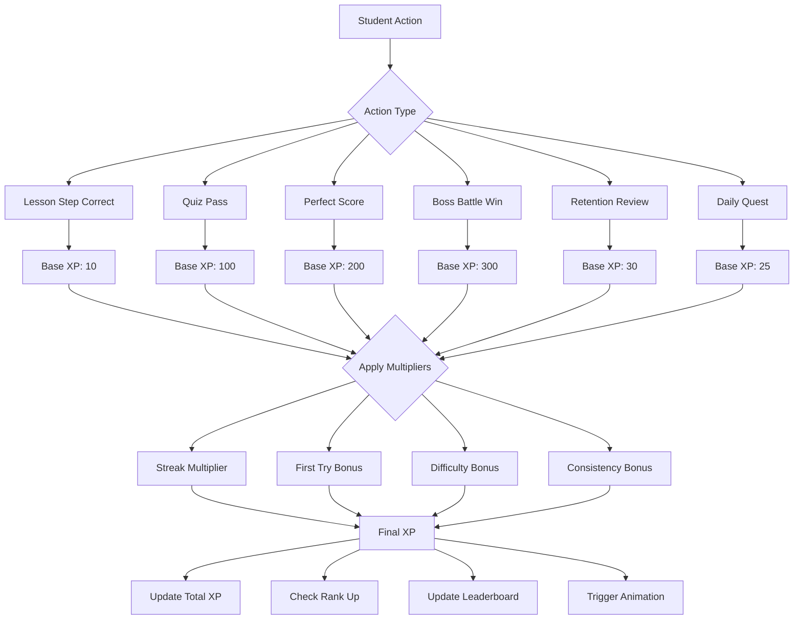
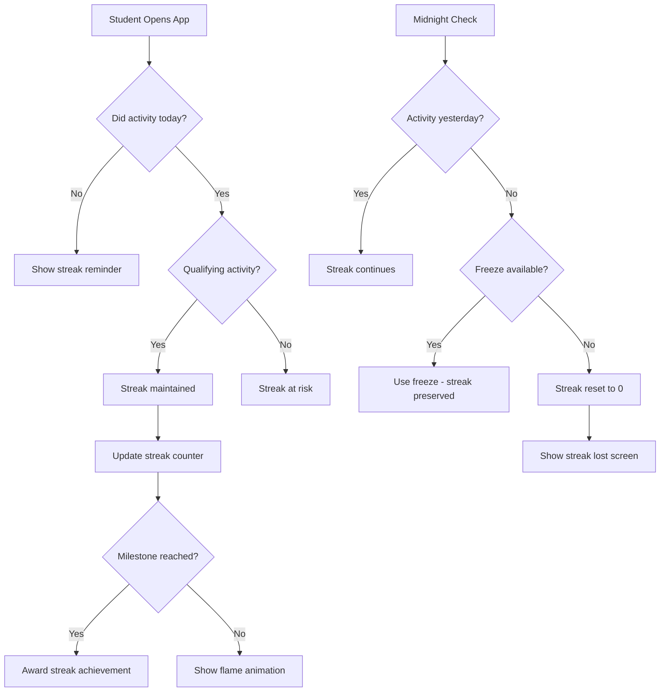
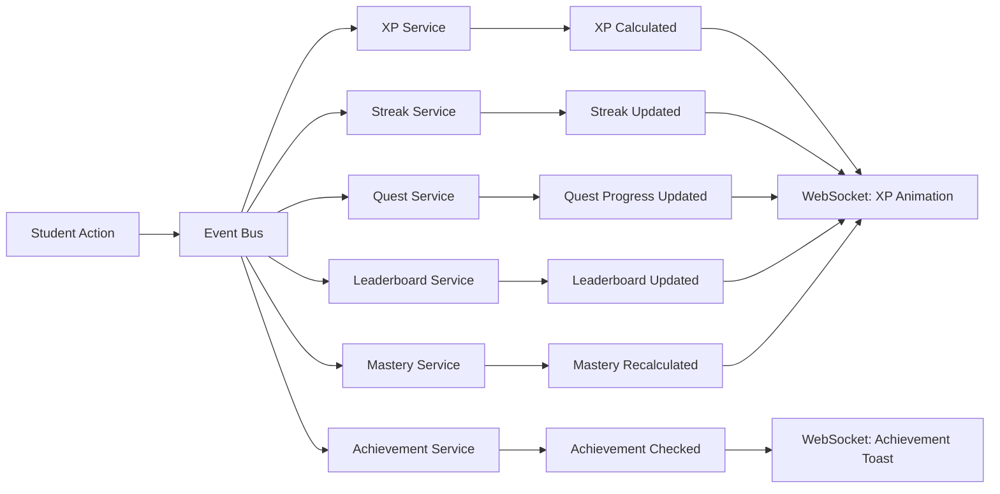

# Gamification System Design

## Philosophy

The gamification system is NOT cosmetic. It is deeply integrated with the educational progression and designed to:

1. **Motivate consistent practice** — Streaks, daily quests
2. **Reward genuine mastery** — XP from accuracy, not time
3. **Create meaningful progression** — Ranks reflect real skill
4. **Drive retention** — Decay systems encourage return
5. **Enable social motivation** — Leaderboards, class competition
6. **Celebrate achievement** — Satisfying animations, sounds

---

## Core Systems

### 1. XP System

XP is the fundamental currency of progression. It is earned through educational activities and weighted by quality.



#### XP Multipliers

| Multiplier | Condition | Bonus |
|-----------|-----------|-------|
| Streak | Active streak | +2 XP per streak day, capped at +50 |
| First Try | Correct on first attempt | +50% |
| Difficulty | Advanced/Expert content | +25%/+50% |
| Consistency | 3+ days in a row with 80%+ accuracy | +15% |
| Perfect Run | All correct in a quiz | +100% bonus |

#### XP Economy Rules

- XP can NEVER be lost
- XP is always additive
- No XP for incorrect answers
- No XP for just viewing content
- Minimal XP for hint-assisted answers (50% reduction)
- Boss battles give highest XP per time spent
- Retention reviews give steady XP to encourage return

---

### 2. Ranking System

Ranks provide long-term progression goals and social status.

```
┌─────────────────────────────────────────────┐
│           RANK PROGRESSION                  │
├─────────────────────────────────────────────┤
│                                             │
│  MASTER      ────── 50,000+ XP             │
│  ═══════                                    │
│                                             │
│  DIAMOND III ────── 40,000 XP              │
│  DIAMOND II  ────── 35,000 XP              │
│  DIAMOND I   ────── 30,000 XP              │
│  ─────────                                  │
│                                             │
│  PLATINUM III ───── 25,000 XP              │
│  PLATINUM II  ───── 20,000 XP              │
│  PLATINUM I   ───── 16,000 XP              │
│  ─────────                                  │
│                                             │
│  GOLD III    ────── 12,000 XP              │
│  GOLD II     ────── 9,000 XP              │
│  GOLD I      ────── 7,000 XP              │
│  ─────────                                  │
│                                             │
│  SILVER III  ────── 5,000 XP              │
│  SILVER II   ────── 3,500 XP              │
│  SILVER I    ────── 2,000 XP              │
│  ─────────                                  │
│                                             │
│  BRONZE III  ────── 1,200 XP              │
│  BRONZE II   ────── 600 XP               │
│  BRONZE I    ────── 0 XP                  │
│                                             │
└─────────────────────────────────────────────┘
```

#### Rank Visuals

| Rank | Color | Glow Effect | Badge Style |
|------|-------|-------------|-------------|
| Bronze | #cd7f32 | Subtle warm glow | Simple shield |
| Silver | #c0c0c0 | Soft silver shimmer | Decorated shield |
| Gold | #ffd700 | Warm golden pulse | Ornate crest |
| Platinum | #e5e4e2 | Cool metallic sheen | Crystal emblem |
| Diamond | #b9f2ff | Electric blue sparkle | Faceted gem |
| Master | #ff6b35 | Fire gradient animation | Legendary crown |

#### Rank-Up Experience
When a student ranks up:
1. Learning stops momentarily
2. Screen dims slightly
3. New rank badge animates in (scale + glow)
4. Particle effects burst
5. Sound effect plays
6. Celebration modal shows new rank + benefits
7. +100 bonus XP awarded
8. Notification sent

---

### 3. Streak System

Streaks drive daily engagement and habit formation.



#### Qualifying Activities for Streak
A streak day requires ONE of:
- Complete 1 lesson
- Pass 1 quiz
- Complete 1 retention review
- Complete 3 practice problems
- Win 1 boss battle

#### Streak Milestones & Rewards

| Streak | Reward | Achievement |
|--------|--------|-------------|
| 3 days | +1 freeze | Warming Up |
| 7 days | +50 XP bonus | Week Warrior |
| 14 days | +1 freeze | Two Week Champion |
| 30 days | +200 XP + badge | Monthly Master |
| 60 days | +500 XP + title | Unstoppable |
| 100 days | +1000 XP + legendary badge | Century Scholar |
| 365 days | Special title + permanent 10% XP boost | Year of Mastery |

#### Streak Visual System
- Days 1-3: Small flame (orange)
- Days 4-7: Medium flame (orange-red)
- Days 8-14: Large flame (red)
- Days 15-30: Blue flame
- Days 31-60: Purple flame
- Days 61-100: Golden flame
- Days 100+: Legendary rainbow flame

---

### 4. Mastery Progression System

Mastery is the true measure of learning. Unlike XP (which is additive), mastery is EARNED and can DECAY.

#### Mastery Levels per Topic

```
NOT STARTED  →  IN PROGRESS  →  PRACTICED  →  PROFICIENT  →  MASTERED
    0%            1-39%           40-69%        70-89%        90-100%
```

#### Mastery Score Calculation

```typescript
function calculateMastery(data: MasteryData): number {
  const weights = {
    quizAccuracy: 0.35,      // Average quiz scores
    consistency: 0.20,        // Consistent performance over time
    retention: 0.25,          // Spaced repetition success
    application: 0.20,        // Cross-topic problem solving
  };

  const score =
    data.quizAccuracy * weights.quizAccuracy +
    data.consistency * weights.consistency +
    data.retention * weights.retention +
    data.application * weights.application;

  return Math.min(1, Math.max(0, score));
}
```

#### Mastery Decay System

Mastery decays over time if not reinforced:

```typescript
function calculateDecay(lastPracticed: Date, currentMastery: number): number {
  const daysSince = daysBetween(lastPracticed, now());
  
  // No decay for first 3 days
  if (daysSince <= 3) return currentMastery;
  
  // Decay rate: 2% per day after 3 days, max 40% total decay
  const decayDays = daysSince - 3;
  const decayAmount = Math.min(0.4, decayDays * 0.02);
  
  // Higher mastery decays slower
  const decayResistance = currentMastery * 0.3; // 30% resistance at full mastery
  const effectiveDecay = decayAmount * (1 - decayResistance);
  
  return Math.max(0.3, currentMastery - effectiveDecay); // Never below 30% once achieved
}
```

#### Mastery Visual

```
NOT STARTED:   ○○○○○  (gray, no glow)
IN PROGRESS:   ●●○○○  (blue, subtle pulse)
PRACTICED:     ●●●○○  (blue-purple, gentle glow)
PROFICIENT:    ●●●●○  (purple, steady glow)
MASTERED:      ●●●●●  (gold, radiant glow + particles)
DECAYING:      ●●●◐○  (orange warning ring)
```

---

### 5. Boss Battle System

Boss battles are challenging assessments that test accumulated knowledge across multiple topics.

#### Boss Battle Structure
```
┌─────────────────────────────────────────┐
│         BOSS BATTLE: Equation Master    │
├─────────────────────────────────────────┤
│                                         │
│  Boss HP: ████████████████░░░░  80/100  │
│                                         │
│  ┌─────────────────────────────────┐    │
│  │                                 │    │
│  │    Question 4 of 10             │    │
│  │                                 │    │
│  │    Solve for x:                 │    │
│  │    3x² + 5x - 2 = 0            │    │
│  │                                 │    │
│  │    [Input field]                │    │
│  │                                 │    │
│  │    ⏱️ 45 seconds remaining      │    │
│  │                                 │    │
│  └─────────────────────────────────┘    │
│                                         │
│  Your HP: ████████████████████  100%    │
│  Combo: x3 🔥                           │
│                                         │
│  [Use Hint -20HP] [Skip -10HP]          │
│                                         │
└─────────────────────────────────────────┘
```

#### Boss Mechanics
- Boss has HP that decreases with each correct answer
- Student has HP that decreases with each wrong answer
- Combo multiplier for consecutive correct answers
- Timer per question adds urgency
- Hints available but cost HP
- Questions pulled from multiple related topics
- Difficulty scales with student level

#### Boss Rewards

| Result | Reward |
|--------|--------|
| Win (no hints) | 400 XP + achievement |
| Win (with hints) | 250 XP |
| Win (barely) | 200 XP |
| Lose | 50 XP (participation) + weak areas shown |
| Perfect (no damage) | 500 XP + rare achievement |

---

### 6. Daily Quest System

Daily quests provide structured daily goals and variety.

#### Quest Generation Algorithm

```typescript
function generateDailyQuests(student: StudentProfile): DailyQuest[] {
  const quests: DailyQuest[] = [];
  
  // Always include: 1 learning quest
  quests.push(selectLearningQuest(student));
  
  // Always include: 1 practice quest
  quests.push(selectPracticeQuest(student));
  
  // Include: 1 retention quest (if decaying topics exist)
  if (hasDecayingTopics(student)) {
    quests.push(createRetentionQuest(student));
  }
  
  // Include: 1 challenge quest (scaled to level)
  quests.push(selectChallengeQuest(student));
  
  // Include: 1 streak quest (if streak active)
  if (student.streak.currentStreak > 0) {
    quests.push(createStreakQuest(student));
  }
  
  return quests.slice(0, 5); // Max 5 daily quests
}
```

#### Quest Types

| Quest | Example | Reward |
|-------|---------|--------|
| Learning | Complete 2 lessons in Algebra | 25 XP |
| Practice | Get 10 problems correct | 25 XP |
| Retention | Review 3 decaying topics | 30 XP |
| Challenge | Score 90%+ on a quiz | 40 XP |
| Streak | Maintain your streak today | 15 XP |
| Boss | Defeat any boss battle | 50 XP |
| Perfect | Get 5 perfect scores | 35 XP |
| Exploration | Try a new topic | 20 XP |

---

### 7. Achievement System

Achievements are permanent badges that recognize significant milestones.

#### Achievement Categories

**Learning Achievements**
| Achievement | Criteria | Rarity |
|------------|----------|--------|
| First Steps | Complete first lesson | Common |
| Quick Learner | Complete 10 lessons | Common |
| Scholar | Complete 50 lessons | Uncommon |
| Knowledge Seeker | Complete 100 lessons | Rare |
| Sage | Complete 500 lessons | Epic |
| Enlightened | Complete 1000 lessons | Legendary |

**Mastery Achievements**
| Achievement | Criteria | Rarity |
|------------|----------|--------|
| Apprentice | Master first topic | Common |
| Specialist | Master 5 topics | Uncommon |
| Expert | Master 15 topics | Rare |
| Grandmaster | Master 50 topics | Epic |
| Omniscient | Master all topics in a subject | Legendary |

**Streak Achievements**
| Achievement | Criteria | Rarity |
|------------|----------|--------|
| Getting Started | 3-day streak | Common |
| Committed | 7-day streak | Common |
| Dedicated | 30-day streak | Uncommon |
| Relentless | 60-day streak | Rare |
| Unstoppable | 100-day streak | Epic |
| Eternal Scholar | 365-day streak | Legendary |

**Challenge Achievements**
| Achievement | Criteria | Rarity |
|------------|----------|--------|
| Boss Slayer | Win first boss battle | Common |
| Flawless Victory | Perfect boss battle | Rare |
| Speed Demon | Complete quiz in under 60s | Uncommon |
| No Hints Needed | 20 lessons without hints | Rare |
| Perfect Week | 100% accuracy for 7 days | Epic |

**Social Achievements**
| Achievement | Criteria | Rarity |
|------------|----------|--------|
| Team Player | Join first classroom | Common |
| Class Leader | Rank #1 in class leaderboard | Uncommon |
| Helpful | Answer 10 discussion questions | Uncommon |
| Mentor | Help 5 classmates via AI-detected explanations | Rare |

---

### 8. Leaderboard System

Leaderboards drive healthy competition and social engagement.

#### Leaderboard Types
- **Global Weekly** — All students, resets Monday
- **Global Monthly** — All students, resets 1st
- **Class Weekly** — Per classroom
- **Subject** — Per subject mastery
- **Friends** — Custom friend lists (future)

#### Leaderboard Rules
- Ranked by XP earned in period
- Top 3 get visual badges
- Ties broken by fewer questions attempted (efficiency)
- New accounts have 7-day grace period (not shown)
- Inactive accounts (7+ days) dimmed
- Anti-gaming: XP from repeated easy content capped

#### Leaderboard Rewards (Weekly)
| Position | Reward |
|----------|--------|
| #1 | 200 bonus XP + Crown badge |
| #2 | 150 bonus XP + Silver medal |
| #3 | 100 bonus XP + Bronze medal |
| Top 10 | 50 bonus XP |
| Top 25% | 25 bonus XP |

---

## Event-Driven Gamification Architecture



### Event Types

```typescript
// Core gamification events
interface GamificationEvents {
  'lesson.step.completed': { studentId: string; stepId: string; correct: boolean; timeSpent: number };
  'lesson.completed': { studentId: string; lessonId: string; score: number };
  'quiz.completed': { studentId: string; quizId: string; score: number; perfect: boolean };
  'boss.defeated': { studentId: string; bossId: string; damage_taken: number };
  'review.completed': { studentId: string; topicId: string; score: number };
  'streak.maintained': { studentId: string; newStreak: number };
  'streak.lost': { studentId: string; previousStreak: number };
  'rank.up': { studentId: string; newRank: string; previousRank: string };
  'achievement.unlocked': { studentId: string; achievementId: string };
  'quest.completed': { studentId: string; questId: string };
}
```

---

## Sound Design

| Event | Sound Style |
|-------|-------------|
| Correct answer | Bright chime (ascending) |
| Wrong answer | Soft low tone (not punishing) |
| XP gained | Coin collect (subtle) |
| Level up | Triumphant fanfare (short) |
| Rank up | Epic orchestral hit |
| Streak maintained | Whoosh + flame crackle |
| Streak lost | Sad descending tone |
| Achievement unlocked | Discovery sparkle |
| Boss battle start | Dramatic intro |
| Boss hit | Impact sound |
| Boss defeated | Victory fanfare |
| Quest complete | Satisfying ding |
| Mastery achieved | Ethereal glow sound |

All sounds should be:
- Short (under 2 seconds except rank up)
- Satisfying but not annoying
- Volume adjustable
- Individually toggleable
- Never interrupt learning flow

---

## Anti-Gaming Measures

1. **XP Cap per Session** — Max 500 XP per 30-minute window
2. **Repeat Content Diminishing Returns** — Repeating same lesson gives 25% XP
3. **Minimum Time Threshold** — Must spend at least 5 seconds per question
4. **Accuracy Requirement** — No XP for scores below 30%
5. **Pattern Detection** — Flag accounts with suspicious answer patterns
6. **Cooldowns** — Boss battles: 1 per topic per day
7. **Progressive Difficulty** — Same-level content stops giving full XP after mastery
