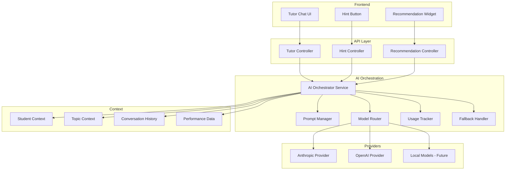
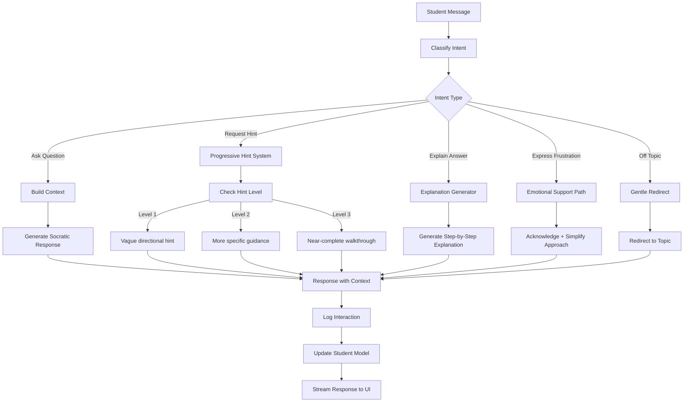
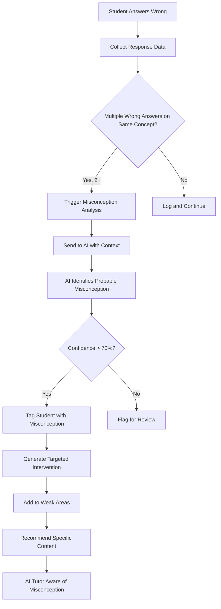

# AI System Design

## Architecture Overview

The AI system is abstracted behind a provider-agnostic orchestration layer. It supports multiple providers, intelligent routing, fallback mechanisms, and educational-specific prompt engineering.



---

## Provider Abstraction Layer

### Interface Definition

```typescript
interface AIProvider {
  id: string;
  name: string;
  
  generateCompletion(request: AICompletionRequest): Promise<AICompletionResponse>;
  generateStream(request: AICompletionRequest): AsyncGenerator<string>;
  
  isAvailable(): Promise<boolean>;
  getUsage(): ProviderUsage;
}

interface AICompletionRequest {
  messages: AIMessage[];
  model?: string;
  temperature?: number;
  maxTokens?: number;
  tools?: AITool[];
  responseFormat?: 'text' | 'json';
  stream?: boolean;
}

interface AICompletionResponse {
  content: string;
  model: string;
  provider: string;
  usage: {
    inputTokens: number;
    outputTokens: number;
    totalTokens: number;
  };
  latencyMs: number;
  finishReason: 'stop' | 'length' | 'tool_use';
  toolCalls?: AIToolCall[];
}

interface AIMessage {
  role: 'system' | 'user' | 'assistant';
  content: string;
}
```

### Model Router

```typescript
interface ModelRoutingConfig {
  purpose: AIPurpose;
  preferredProvider: 'anthropic' | 'openai';
  preferredModel: string;
  fallbackProvider: 'anthropic' | 'openai';
  fallbackModel: string;
  maxTokens: number;
  temperature: number;
}

const MODEL_ROUTING: Record<AIPurpose, ModelRoutingConfig> = {
  tutoring: {
    purpose: 'tutoring',
    preferredProvider: 'anthropic',
    preferredModel: 'claude-sonnet-4-20250514',
    fallbackProvider: 'openai',
    fallbackModel: 'gpt-4o',
    maxTokens: 2000,
    temperature: 0.7,
  },
  hints: {
    purpose: 'hints',
    preferredProvider: 'anthropic',
    preferredModel: 'claude-sonnet-4-20250514',
    fallbackProvider: 'openai',
    fallbackModel: 'gpt-4o-mini',
    maxTokens: 500,
    temperature: 0.5,
  },
  explanation: {
    purpose: 'explanation',
    preferredProvider: 'anthropic',
    preferredModel: 'claude-sonnet-4-20250514',
    fallbackProvider: 'openai',
    fallbackModel: 'gpt-4o',
    maxTokens: 1500,
    temperature: 0.6,
  },
  misconceptionDetection: {
    purpose: 'misconceptionDetection',
    preferredProvider: 'openai',
    preferredModel: 'gpt-4o',
    fallbackProvider: 'anthropic',
    fallbackModel: 'claude-sonnet-4-20250514',
    maxTokens: 1000,
    temperature: 0.3,
  },
  adaptiveRecommendation: {
    purpose: 'adaptiveRecommendation',
    preferredProvider: 'openai',
    preferredModel: 'gpt-4o',
    fallbackProvider: 'anthropic',
    fallbackModel: 'claude-sonnet-4-20250514',
    maxTokens: 800,
    temperature: 0.4,
  },
  structuredOutput: {
    purpose: 'structuredOutput',
    preferredProvider: 'openai',
    preferredModel: 'gpt-4o',
    fallbackProvider: 'anthropic',
    fallbackModel: 'claude-sonnet-4-20250514',
    maxTokens: 1000,
    temperature: 0.2,
  },
};
```

---

## AI Tutor System

### Tutor Personality & Behavior

The AI tutor should:
- Be encouraging but not patronizing
- Ask probing questions rather than giving answers directly
- Use the Socratic method
- Adapt language complexity to student level
- Reference the current topic context
- Detect misconceptions and address them
- Provide step-by-step guidance
- Celebrate genuine understanding
- Never do the work for the student

### System Prompt Architecture

```typescript
function buildTutorSystemPrompt(context: TutorContext): string {
  return `
You are an expert educational tutor for ${context.subject} on the Nexsori Learning Platform.

## Your Identity
- Name: Nexsori Tutor
- Personality: Patient, encouraging, intellectually curious
- Teaching style: Socratic method - guide through questions, don't give direct answers
- Tone: Warm but academically rigorous

## Current Context
- Student: ${context.studentName}, Grade ${context.gradeLevel}
- Current topic: ${context.topicName}
- Current lesson: ${context.lessonTitle || 'General practice'}
- Student mastery level: ${context.masteryLevel}
- Known weak areas: ${context.weakAreas.join(', ')}
- Recent performance: ${context.recentPerformance}

## Teaching Rules
1. NEVER give the direct answer. Guide the student to discover it.
2. If they're stuck, break the problem into smaller steps.
3. Ask "What do you think?" or "What if..." questions.
4. When they get something right, briefly celebrate, then push deeper.
5. If they show a misconception, address it directly but gently.
6. Use analogies and real-world examples when helpful.
7. Keep responses concise - max 3-4 paragraphs unless explaining a complex concept.
8. Use markdown for formatting math: $equation$ for inline, $$equation$$ for block.
9. If the student is frustrated, acknowledge it and simplify your approach.
10. Track the conversation flow - don't repeat yourself.

## Response Format
- Start with acknowledgment of their input
- Provide guidance or a guiding question
- End with encouragement or a prompt to try

## Boundaries
- Only discuss topics related to the current subject and curriculum
- Do not discuss topics outside of education
- If asked about unrelated topics, gently redirect
- Never provide homework answers verbatim
- Never pretend to be human
`.trim();
}
```

### Conversation Flow



---

## Hint System

### Progressive Hints

Hints are never free — they cost XP reward reduction. Each level reveals more.

```typescript
interface HintRequest {
  studentId: string;
  questionId: string;
  lessonStepId?: string;
  currentHintLevel: number; // 0 = no hints used yet
  studentAnswer?: string;   // Their attempted answer (if any)
}

interface HintResponse {
  hintLevel: number;
  hint: string;
  xpPenalty: number;       // How much XP is reduced
  remainingHints: number;
  isLastHint: boolean;
}

const HINT_LEVELS = {
  1: {
    description: 'General direction',
    xpPenaltyPercent: 25,   // Lose 25% of question XP
    promptInstruction: 'Give a vague, directional hint. Do NOT reveal the answer or method. Just point them in the right direction.',
  },
  2: {
    description: 'Specific guidance',
    xpPenaltyPercent: 50,   // Lose 50% of question XP
    promptInstruction: 'Give a more specific hint. You can mention the relevant formula or concept, but do NOT show how to apply it to this specific problem.',
  },
  3: {
    description: 'Near-complete walkthrough',
    xpPenaltyPercent: 75,   // Lose 75% of question XP
    promptInstruction: 'Walk through most of the solution process. Show the first few steps clearly. Stop just before the final answer.',
  },
};
```

### Hint Generation Prompt

```typescript
function buildHintPrompt(context: HintContext): string {
  return `
You are generating a hint for a student.

## Question
${context.questionStem}

## Correct Answer
${context.correctAnswer}

## Student's Attempt (if any)
${context.studentAnswer || 'No attempt yet'}

## Hint Level: ${context.hintLevel}
${HINT_LEVELS[context.hintLevel].promptInstruction}

## Student Context
- Topic: ${context.topicName}
- Mastery: ${context.masteryLevel}
- Common misconceptions for this topic: ${context.commonMisconceptions}

## Rules
- Be concise (1-3 sentences for level 1, up to a paragraph for level 3)
- Use encouraging language
- Reference concepts they should know based on their progress
- Use $math$ notation for equations
- Do NOT explicitly state the final answer at any hint level
`.trim();
}
```

---

## Misconception Detection

### How It Works



### Misconception Detection Prompt

```typescript
function buildMisconceptionPrompt(context: MisconceptionContext): string {
  return `
Analyze this student's wrong answers to identify their likely misconception.

## Topic: ${context.topicName}

## Recent Wrong Answers:
${context.wrongAnswers.map((wa, i) => `
${i + 1}. Question: ${wa.question}
   Correct Answer: ${wa.correctAnswer}
   Student Answer: ${wa.studentAnswer}
   Time Spent: ${wa.timeSpent}s
`).join('')}

## Task
1. Identify the most likely misconception or knowledge gap
2. Explain WHY the student probably thinks this way
3. Suggest a targeted intervention approach
4. Rate your confidence (0-100%)

## Response Format (JSON)
{
  "misconception": "Brief description of the misconception",
  "explanation": "Why the student likely has this misconception",
  "evidence": "Which answers support this diagnosis",
  "intervention": "Suggested teaching approach to correct it",
  "confidence": 85,
  "relatedConcepts": ["concept1", "concept2"],
  "suggestedContent": "What specific content would help"
}
`.trim();
}
```

---

## Adaptive Recommendation Engine

### Recommendation Types

| Type | Trigger | Output |
|------|---------|--------|
| Next Lesson | Lesson completed | Best next lesson to maximize learning |
| Review Priority | Mastery decay detected | Topics to review, ordered by urgency |
| Weak Area Focus | Quiz failures | Specific concepts needing attention |
| Challenge Ready | High mastery | Boss battles or advanced content |
| Prerequisite Gap | Failed prerequisite check | Missing foundation topics |

### Recommendation Algorithm

```typescript
interface RecommendationContext {
  studentId: string;
  currentProgress: StudentProgress[];
  recentPerformance: QuizAttempt[];
  decayingTopics: RetentionRecord[];
  availableContent: Topic[];
  timeAvailable?: number; // minutes
}

function generateRecommendations(ctx: RecommendationContext): Recommendation[] {
  const recommendations: Recommendation[] = [];
  
  // Priority 1: Critical decay (mastery dropping fast)
  const criticalDecay = ctx.decayingTopics
    .filter(t => t.retentionScore < 0.5 && t.masteryLevel > 0.7)
    .sort((a, b) => a.retentionScore - b.retentionScore);
  
  for (const topic of criticalDecay.slice(0, 2)) {
    recommendations.push({
      type: 'RETENTION_REVIEW',
      priority: 'HIGH',
      topicId: topic.topicId,
      reason: `Your mastery of ${topic.name} is fading. A quick review will restore it.`,
      estimatedTime: 5,
      xpReward: 30,
    });
  }
  
  // Priority 2: Weak areas from recent failures
  const weakAreas = identifyWeakAreas(ctx.recentPerformance);
  for (const area of weakAreas.slice(0, 2)) {
    recommendations.push({
      type: 'WEAK_AREA_PRACTICE',
      priority: 'MEDIUM',
      topicId: area.topicId,
      reason: `You're struggling with ${area.conceptName}. Targeted practice will help.`,
      estimatedTime: 10,
      xpReward: 50,
    });
  }
  
  // Priority 3: Continue current learning path
  const nextInPath = findNextLesson(ctx.currentProgress, ctx.availableContent);
  if (nextInPath) {
    recommendations.push({
      type: 'CONTINUE_LEARNING',
      priority: 'NORMAL',
      topicId: nextInPath.topicId,
      lessonId: nextInPath.lessonId,
      reason: `Continue where you left off in ${nextInPath.topicName}.`,
      estimatedTime: 15,
      xpReward: 50,
    });
  }
  
  // Priority 4: Challenge (if student is performing well)
  if (isPerformingWell(ctx.recentPerformance)) {
    recommendations.push({
      type: 'BOSS_BATTLE',
      priority: 'LOW',
      reason: `You're on fire! Ready for a boss battle?`,
      estimatedTime: 10,
      xpReward: 300,
    });
  }
  
  return recommendations.sort((a, b) => priorityScore(a) - priorityScore(b));
}
```

---

## AI Usage & Rate Limiting

### Rate Limits

| Plan | AI Queries/Day | Tutor Messages/Day | Hints/Day |
|------|---------------|-------------------|-----------|
| Free | 10 | 5 | 10 |
| Student Pro | 100 | 50 | Unlimited |
| School | 200 per student | 100 | Unlimited |
| Enterprise | Unlimited | Unlimited | Unlimited |

### Cost Management

```typescript
interface AIUsageTracker {
  trackUsage(params: {
    userId: string;
    provider: string;
    model: string;
    purpose: AIPurpose;
    inputTokens: number;
    outputTokens: number;
    latencyMs: number;
  }): Promise<void>;
  
  checkRateLimit(userId: string, purpose: AIPurpose): Promise<RateLimitResult>;
  getDailyUsage(userId: string): Promise<DailyUsage>;
  getMonthlyReport(): Promise<MonthlyAIReport>;
}

// Estimated costs per interaction
const COST_ESTIMATES = {
  tutoring: { avgTokens: 3000, avgCost: 0.015 },     // ~$0.015 per message
  hints: { avgTokens: 800, avgCost: 0.004 },          // ~$0.004 per hint
  explanation: { avgTokens: 2000, avgCost: 0.010 },    // ~$0.01 per explanation
  misconception: { avgTokens: 1500, avgCost: 0.008 },  // ~$0.008 per analysis
  recommendation: { avgTokens: 1000, avgCost: 0.005 }, // ~$0.005 per recommendation
};
```

---

## AI Response Quality

### Evaluation Criteria

Every AI response should be:

1. **Educationally Sound** — Factually correct, pedagogically appropriate
2. **Level-Appropriate** — Matches student grade and mastery
3. **Concise** — Never verbose or overwhelming
4. **Actionable** — Student knows what to do next
5. **Encouraging** — Positive but honest
6. **Safe** — No harmful content, no academic dishonesty

### Quality Assurance

```typescript
interface ResponseValidator {
  // Check response doesn't reveal answer directly (for hints)
  validateNoDirectAnswer(response: string, correctAnswer: string): boolean;
  
  // Check response is on-topic
  validateTopicRelevance(response: string, topic: string): boolean;
  
  // Check response length is appropriate
  validateLength(response: string, purpose: AIPurpose): boolean;
  
  // Check for harmful content
  validateSafety(response: string): boolean;
  
  // Check mathematical accuracy (for math responses)
  validateMathAccuracy(response: string): boolean;
}
```

---

## Streaming Architecture

AI responses are streamed to provide instant feedback:

```typescript
// Backend: NestJS SSE endpoint
@Get('tutor/stream')
@Sse()
async streamTutorResponse(
  @Query('sessionId') sessionId: string,
  @Query('message') message: string,
  @CurrentUser() user: UserPayload,
): Observable<MessageEvent> {
  return new Observable((observer) => {
    const stream = this.aiOrchestrator.streamResponse({
      purpose: 'tutoring',
      sessionId,
      message,
      userId: user.id,
    });
    
    for await (const chunk of stream) {
      observer.next({ data: chunk });
    }
    
    observer.complete();
  });
}

// Frontend: React hook
function useTutorStream() {
  const [response, setResponse] = useState('');
  const [isStreaming, setIsStreaming] = useState(false);
  
  const sendMessage = async (message: string, sessionId: string) => {
    setIsStreaming(true);
    setResponse('');
    
    const eventSource = new EventSource(
      `/api/ai/tutor/stream?sessionId=${sessionId}&message=${encodeURIComponent(message)}`
    );
    
    eventSource.onmessage = (event) => {
      setResponse(prev => prev + event.data);
    };
    
    eventSource.onerror = () => {
      eventSource.close();
      setIsStreaming(false);
    };
  };
  
  return { response, isStreaming, sendMessage };
}
```

---

## Future AI Capabilities (Post-MVP)

| Feature | Description | Phase |
|---------|-------------|-------|
| Voice Tutoring | Speech-to-text + AI + text-to-speech | Phase 3 |
| Image Analysis | Student uploads work photo for feedback | Phase 2 |
| Auto-Grading | AI grades free-response answers | Phase 2 |
| Content Generation | AI helps create new lessons | Phase 3 |
| Learning Path Optimization | ML-based path optimization | Phase 3 |
| Peer Matching | AI matches study partners | Phase 4 |
| Predictive Analytics | Predict student struggles before they happen | Phase 3 |
| Smart Scheduling | AI optimizes study schedule | Phase 3 |
