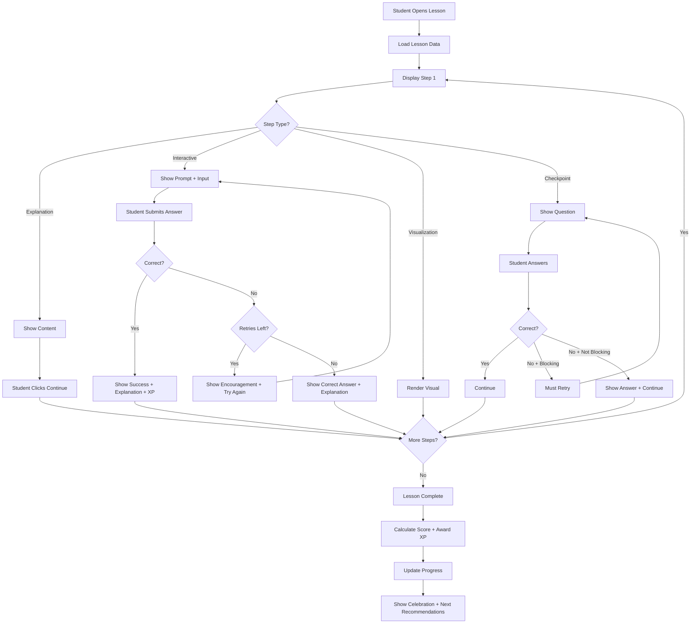
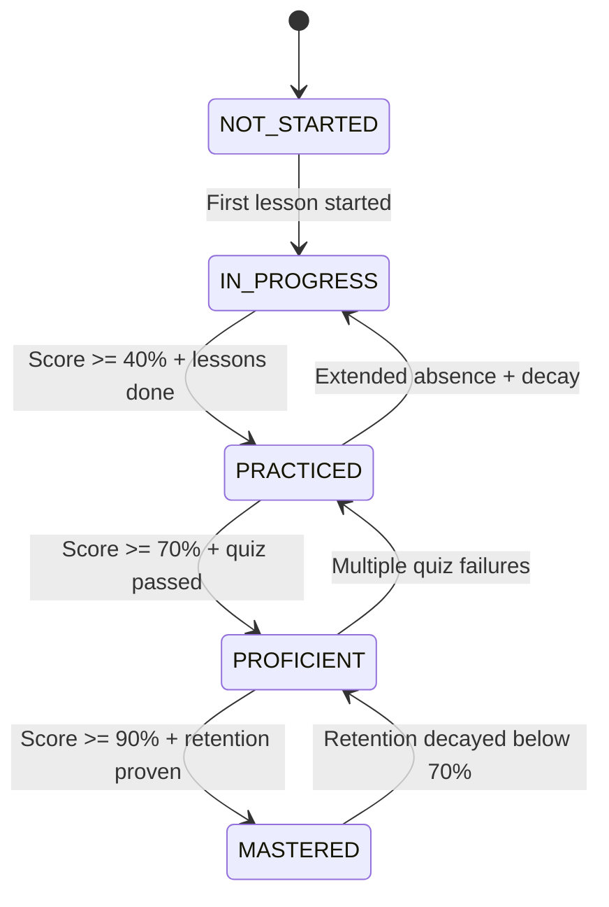
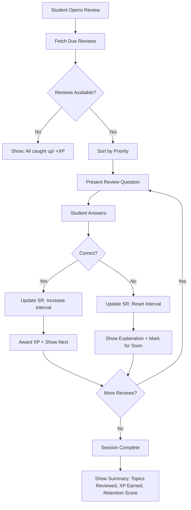

# Learning Engine Design

## Core Learning Philosophy

The learning engine implements the core loop:
**Learn → Practice → Explain → Apply → Master → Rank Up**

Every interaction is designed to move a student through this progression cycle.

---

## Lesson System

### Lesson Types

| Type | Description | Inspired By | Use Case |
|------|-------------|-------------|----------|
| Interactive | Step-by-step with inline questions | Brilliant.org | Core concept teaching |
| Guided | Teacher-guided walkthrough | Khan Academy | Complex procedures |
| Exploration | Open-ended discovery | Desmos | Intuition building |
| Application | Real-world problem solving | Custom | Transfer of knowledge |

### Lesson Step Types

```typescript
type LessonStep = 
  | ExplanationStep    // Text + visuals explaining a concept
  | InteractiveStep    // Requires student input/action
  | VisualizationStep  // Animated/interactive visual
  | CheckpointStep     // Quick knowledge check
  | SummaryStep;       // End-of-section recap

interface ExplanationStep {
  type: 'EXPLANATION';
  content: {
    title?: string;
    body: string;           // Markdown with LaTeX support
    media?: MediaBlock[];   // Images, diagrams, animations
    callouts?: Callout[];   // Tips, warnings, key insights
    revealSections?: RevealSection[]; // Progressive disclosure
  };
}

interface InteractiveStep {
  type: 'INTERACTIVE';
  content: {
    prompt: string;
    interactionType: InteractionType;
    options?: Option[];           // For MCQ
    correctAnswer: any;           // Expected answer
    acceptableRange?: number;     // For numeric (margin of error)
    validation?: ValidationRule;  // Custom validation
    hints: string[];              // Progressive hints
    explanation: string;          // Shown after answering
    retryAllowed: boolean;
    xpReward: number;
  };
}

interface VisualizationStep {
  type: 'VISUALIZATION';
  content: {
    title?: string;
    description?: string;
    visualType: 'graph' | 'animation' | 'simulation' | 'diagram';
    config: Record<string, any>; // Visualization-specific config
    interactive: boolean;         // Can student manipulate?
    parameters?: Parameter[];     // Adjustable parameters
  };
}

interface CheckpointStep {
  type: 'CHECKPOINT';
  content: {
    question: string;
    type: QuestionType;
    options?: Option[];
    correctAnswer: any;
    explanation: string;
    xpReward: number;
    isBlocking: boolean; // Must answer correctly to proceed
  };
}
```

### Lesson Flow



---

## Quiz Engine

### Quiz Types & Behavior

| Quiz Type | Purpose | Timing | Attempts | Adaptive |
|-----------|---------|--------|----------|----------|
| Mastery Check | End-of-topic assessment | No limit | 3 | No |
| Diagnostic | Placement/level testing | No limit | 1 | Yes |
| Practice | Repetition and reinforcement | No limit | Unlimited | No |
| Boss Battle | Gamified challenge | Timed | 1/day | Yes |
| Retention Check | Spaced repetition review | No limit | Unlimited | No |
| Assignment | Teacher-assigned | Due date | Configurable | No |

### Adaptive Quiz Algorithm

For diagnostic and boss battles, questions adapt to student performance:

```typescript
interface AdaptiveQuizEngine {
  currentDifficulty: number;     // 1-10 scale
  questionsAsked: number;
  correctAnswers: number;
  consecutiveCorrect: number;
  consecutiveWrong: number;
  estimatedAbility: number;      // Bayesian estimate
  
  selectNextQuestion(): Question;
  updateAfterResponse(correct: boolean, timeSpent: number): void;
  shouldTerminate(): boolean;
  calculateFinalScore(): number;
}

function selectNextQuestion(state: AdaptiveState, pool: Question[]): Question {
  // Item Response Theory - select question at estimated ability level
  const targetDifficulty = state.estimatedAbility;
  
  // Find questions near target difficulty that haven't been asked
  const candidates = pool
    .filter(q => !state.askedQuestions.has(q.id))
    .sort((a, b) => 
      Math.abs(a.difficultyLevel - targetDifficulty) - 
      Math.abs(b.difficultyLevel - targetDifficulty)
    );
  
  // Add some randomness to prevent predictability
  const topCandidates = candidates.slice(0, 5);
  return topCandidates[Math.floor(Math.random() * topCandidates.length)];
}

function updateAbilityEstimate(state: AdaptiveState, correct: boolean): number {
  // Simplified Bayesian update
  const questionDifficulty = state.currentQuestion.difficultyLevel;
  const adjustment = correct ? 0.3 : -0.3;
  const weight = 1 / (state.questionsAsked + 1); // Decreasing weight
  
  return state.estimatedAbility + (adjustment * weight);
}
```

### Question Rendering

```typescript
interface QuestionRenderer {
  // Each question type has a specific renderer
  renderers: Record<QuestionType, React.ComponentType<QuestionProps>>;
}

// Example: Multiple Choice
interface MCQProps {
  stem: string;
  options: { id: string; label: string; content: string }[];
  onSelect: (optionId: string) => void;
  selectedOption: string | null;
  showResult: boolean;
  correctOption: string;
  explanation: string;
}

// Example: Numeric Input
interface NumericInputProps {
  stem: string;
  unit?: string;
  precision?: number;
  onSubmit: (value: number) => void;
  showResult: boolean;
  correctAnswer: number;
  acceptableRange: number;
  explanation: string;
}

// Example: Drag and Drop Ordering
interface OrderingProps {
  stem: string;
  items: { id: string; content: string }[];
  onReorder: (orderedIds: string[]) => void;
  showResult: boolean;
  correctOrder: string[];
  explanation: string;
}
```

---

## Mastery System

### Mastery Calculation Engine

```typescript
interface MasteryCalculator {
  calculateTopicMastery(params: {
    quizScores: QuizScore[];
    lessonCompletions: LessonCompletion[];
    retentionData: RetentionRecord;
    applicationData: CrossTopicPerformance;
  }): MasteryResult;
}

interface MasteryResult {
  level: number;          // 0-1
  status: MasteryStatus;
  components: {
    understanding: number;  // From lesson scores
    accuracy: number;       // From quiz accuracy
    retention: number;      // From spaced repetition
    application: number;    // From cross-topic problems
  };
  trend: 'improving' | 'stable' | 'declining';
  nextActions: string[];   // What to do to improve
}

function calculateTopicMastery(data: MasteryData): number {
  // Weight recent performance more heavily
  const recentQuizScores = data.quizScores
    .sort((a, b) => b.date.getTime() - a.date.getTime())
    .slice(0, 5); // Last 5 attempts
  
  const avgQuizScore = weightedAverage(recentQuizScores, 'recency');
  
  // Lesson completion quality
  const lessonScore = data.lessonCompletions.length > 0
    ? average(data.lessonCompletions.map(l => l.score))
    : 0;
  
  // Retention (decays over time)
  const retentionScore = data.retentionData?.retentionScore ?? 0;
  
  // Cross-topic application
  const applicationScore = data.applicationData?.score ?? 0;
  
  // Weighted combination
  const mastery = 
    avgQuizScore * 0.35 +
    lessonScore * 0.15 +
    retentionScore * 0.30 +
    applicationScore * 0.20;
  
  return Math.min(1, Math.max(0, mastery));
}
```

### Mastery Status Transitions



---

## Skill Tree System

### Structure

The skill tree is a directed acyclic graph (DAG) of topics within a subject.

```typescript
interface SkillTreeNode {
  topicId: string;
  name: string;
  position: { x: number; y: number };
  masteryStatus: MasteryStatus;
  masteryLevel: number;
  isUnlocked: boolean;
  prerequisites: string[];  // topicIds that must be mastered
  dependents: string[];     // topicIds that this unlocks
}

interface SkillTreeEdge {
  from: string;     // prerequisite topicId
  to: string;       // dependent topicId
  requiredMastery: number; // 0-1
}

interface SkillTree {
  subjectId: string;
  nodes: SkillTreeNode[];
  edges: SkillTreeEdge[];
}
```

### Unlock Logic

```typescript
function checkTopicUnlock(
  topicId: string,
  prerequisites: TopicPrerequisite[],
  studentProgress: Map<string, StudentProgress>,
): UnlockResult {
  if (prerequisites.length === 0) {
    return { unlocked: true, reason: 'No prerequisites' };
  }
  
  const unmetPrereqs: UnmetPrerequisite[] = [];
  
  for (const prereq of prerequisites) {
    const progress = studentProgress.get(prereq.prerequisiteId);
    const currentMastery = progress?.masteryLevel ?? 0;
    
    if (currentMastery < prereq.requiredMastery) {
      unmetPrereqs.push({
        topicId: prereq.prerequisiteId,
        topicName: prereq.prerequisite.name,
        currentMastery,
        requiredMastery: prereq.requiredMastery,
        gap: prereq.requiredMastery - currentMastery,
      });
    }
  }
  
  return {
    unlocked: unmetPrereqs.length === 0,
    unmetPrerequisites: unmetPrereqs,
    reason: unmetPrereqs.length > 0
      ? `Need to master: ${unmetPrereqs.map(p => p.topicName).join(', ')}`
      : 'All prerequisites met',
  };
}
```

### Visual States

| State | Visual | Interaction |
|-------|--------|-------------|
| Locked | Gray, dimmed, lock icon | Click shows prerequisites needed |
| Unlocked (not started) | Colored outline, no fill | Click enters topic |
| In Progress | Partial fill, blue glow | Click continues learning |
| Practiced | More fill, purple glow | Click shows progress |
| Proficient | Nearly full, bright glow | Click reviews or advances |
| Mastered | Full gold, particle effects | Click shows achievements |
| Decaying | Orange warning ring | Click prompts review |

---

## Spaced Repetition Engine

Based on a modified SM-2 algorithm optimized for educational content.

```typescript
interface SpacedRepetitionEngine {
  calculateNextReview(params: {
    currentInterval: number;    // Days
    easeFactor: number;         // 1.3 - 2.5+
    repetitions: number;        // Successful reviews
    lastScore: number;          // 0-1 on last review
    difficulty: number;         // Question difficulty
  }): ReviewSchedule;
}

function calculateNextReview(params: ReviewParams): ReviewSchedule {
  const { currentInterval, easeFactor, repetitions, lastScore } = params;
  
  // Score quality mapping (0-5 scale internally)
  const quality = Math.round(lastScore * 5);
  
  let newInterval: number;
  let newEaseFactor: number;
  let newRepetitions: number;
  
  if (quality >= 3) {
    // Successful review
    newRepetitions = repetitions + 1;
    
    if (newRepetitions === 1) {
      newInterval = 1;        // Review tomorrow
    } else if (newRepetitions === 2) {
      newInterval = 3;        // Review in 3 days
    } else {
      newInterval = Math.round(currentInterval * easeFactor);
    }
    
    // Update ease factor
    newEaseFactor = easeFactor + (0.1 - (5 - quality) * (0.08 + (5 - quality) * 0.02));
    newEaseFactor = Math.max(1.3, newEaseFactor);
  } else {
    // Failed review - reset
    newRepetitions = 0;
    newInterval = 1;           // Review tomorrow
    newEaseFactor = Math.max(1.3, easeFactor - 0.2);
  }
  
  // Cap maximum interval at 90 days
  newInterval = Math.min(90, newInterval);
  
  return {
    nextReviewDate: addDays(new Date(), newInterval),
    interval: newInterval,
    easeFactor: newEaseFactor,
    repetitions: newRepetitions,
  };
}
```

### Review Session Flow



---

## Weak Area Detection

### Detection Algorithm

```typescript
interface WeakAreaDetector {
  analyze(params: {
    studentId: string;
    recentAttempts: QuizAttempt[];
    lessonPerformance: LessonCompletion[];
    timeWindow: number; // Days to look back
  }): WeakArea[];
}

interface WeakArea {
  topicId: string;
  topicName: string;
  severity: 'critical' | 'moderate' | 'mild';
  indicators: string[];
  suggestedAction: string;
  estimatedRecoveryTime: number; // Minutes
}

function detectWeakAreas(data: PerformanceData): WeakArea[] {
  const weakAreas: WeakArea[] = [];
  
  for (const topic of data.topics) {
    const indicators: string[] = [];
    let severityScore = 0;
    
    // Check 1: Low quiz scores
    const avgScore = average(topic.recentQuizScores);
    if (avgScore < 0.5) {
      indicators.push(`Average score: ${(avgScore * 100).toFixed(0)}%`);
      severityScore += 3;
    } else if (avgScore < 0.7) {
      indicators.push(`Below proficiency: ${(avgScore * 100).toFixed(0)}%`);
      severityScore += 1;
    }
    
    // Check 2: Declining trend
    if (isDecreasingTrend(topic.recentQuizScores)) {
      indicators.push('Performance declining');
      severityScore += 2;
    }
    
    // Check 3: High hint usage
    if (topic.avgHintsPerQuestion > 1.5) {
      indicators.push('Heavy reliance on hints');
      severityScore += 1;
    }
    
    // Check 4: Repeated mistakes on same concept
    const repeatedErrors = findRepeatedErrors(topic.responses);
    if (repeatedErrors.length > 0) {
      indicators.push(`Recurring errors in: ${repeatedErrors.join(', ')}`);
      severityScore += 2;
    }
    
    // Check 5: Long time on questions (confusion signal)
    if (topic.avgTimePerQuestion > topic.expectedTime * 2) {
      indicators.push('Taking significantly longer than expected');
      severityScore += 1;
    }
    
    if (severityScore > 0) {
      weakAreas.push({
        topicId: topic.id,
        topicName: topic.name,
        severity: severityScore >= 5 ? 'critical' : severityScore >= 3 ? 'moderate' : 'mild',
        indicators,
        suggestedAction: generateSuggestedAction(topic, severityScore),
        estimatedRecoveryTime: estimateRecoveryTime(severityScore, topic),
      });
    }
  }
  
  return weakAreas.sort((a, b) => severityOrder(b.severity) - severityOrder(a.severity));
}
```

---

## Content Structure (Math MVP)

### Subject: Mathematics

```
Mathematics/
├── Foundations/
│   ├── Number Sense
│   ├── Basic Operations
│   ├── Fractions & Decimals
│   ├── Ratios & Proportions
│   └── Order of Operations
├── Pre-Algebra/
│   ├── Variables & Expressions
│   ├── Linear Equations (1 variable)
│   ├── Inequalities
│   ├── Absolute Value
│   └── Introduction to Functions
├── Algebra I/
│   ├── Linear Functions
│   ├── Systems of Equations
│   ├── Polynomials
│   ├── Factoring
│   ├── Quadratic Equations
│   ├── Quadratic Functions
│   └── Exponential Functions
├── Geometry/
│   ├── Points, Lines, Planes
│   ├── Angles & Triangles
│   ├── Congruence & Similarity
│   ├── Circles
│   ├── Area & Volume
│   ├── Coordinate Geometry
│   └── Transformations
├── Algebra II/
│   ├── Complex Numbers
│   ├── Polynomial Functions
│   ├── Rational Functions
│   ├── Logarithms
│   ├── Sequences & Series
│   └── Probability & Statistics
├── Trigonometry/
│   ├── Right Triangle Trig
│   ├── Unit Circle
│   ├── Trig Functions
│   ├── Trig Identities
│   └── Applications
├── Pre-Calculus/
│   ├── Advanced Functions
│   ├── Limits Introduction
│   ├── Parametric Equations
│   ├── Polar Coordinates
│   └── Vectors
└── Calculus/
    ├── Limits & Continuity
    ├── Derivatives
    ├── Applications of Derivatives
    ├── Integrals
    └── Applications of Integrals
```

### Example Lesson: Quadratic Formula

```json
{
  "id": "lesson_quadratic_formula",
  "topicId": "topic_quadratic_equations",
  "title": "The Quadratic Formula",
  "type": "INTERACTIVE",
  "difficulty": "INTERMEDIATE",
  "xpReward": 60,
  "estimatedTime": 15,
  "steps": [
    {
      "order": 1,
      "type": "EXPLANATION",
      "content": {
        "body": "We have seen that some quadratic equations can be solved by factoring. But what about equations like $x^2 + 3x - 7 = 0$? These do not factor neatly.\n\nWe need a universal method that works for ALL quadratic equations.",
        "callouts": [
          { "type": "insight", "text": "The quadratic formula works for every quadratic equation, even ones that cannot be factored." }
        ]
      }
    },
    {
      "order": 2,
      "type": "CHECKPOINT",
      "content": {
        "question": "Can the equation $x^2 + 3x - 7 = 0$ be easily factored?",
        "type": "MULTIPLE_CHOICE",
        "options": [
          { "id": "a", "content": "Yes, it factors to $(x+7)(x-1)$" },
          { "id": "b", "content": "Yes, it factors to $(x-7)(x+1)$" },
          { "id": "c", "content": "No, there are no integer factors of -7 that sum to 3" }
        ],
        "correctAnswer": "c",
        "explanation": "We need factors of -7 that add to 3. The factor pairs of -7 are: (1,-7) and (-1,7). Neither pair sums to 3.",
        "isBlocking": false,
        "xpReward": 10
      }
    },
    {
      "order": 3,
      "type": "EXPLANATION",
      "content": {
        "body": "## Deriving the Formula\n\nStarting from $ax^2 + bx + c = 0$, we can use **completing the square** to derive a general solution.\n\n$$x = \\frac{-b \\pm \\sqrt{b^2 - 4ac}}{2a}$$\n\nThis is the **Quadratic Formula**.",
        "revealSections": [
          {
            "label": "See the full derivation",
            "content": "Step 1: $ax^2 + bx + c = 0$\nStep 2: $x^2 + \\frac{b}{a}x = -\\frac{c}{a}$\n..."
          }
        ]
      }
    },
    {
      "order": 4,
      "type": "INTERACTIVE",
      "content": {
        "prompt": "Using the quadratic formula, solve $x^2 + 5x + 6 = 0$.\n\nIdentify the values: $a = $ ___, $b = $ ___, $c = $ ___",
        "interactionType": "FILL_BLANK",
        "correctAnswer": { "a": 1, "b": 5, "c": 6 },
        "hints": [
          "Compare with the standard form $ax^2 + bx + c = 0$",
          "The coefficient of $x^2$ is a, the coefficient of x is b, and the constant is c"
        ],
        "explanation": "In $x^2 + 5x + 6 = 0$: a=1 (coefficient of x²), b=5 (coefficient of x), c=6 (constant term)",
        "retryAllowed": true,
        "xpReward": 10
      }
    },
    {
      "order": 5,
      "type": "INTERACTIVE",
      "content": {
        "prompt": "Now calculate the discriminant $b^2 - 4ac$ for the equation $x^2 + 5x + 6 = 0$",
        "interactionType": "NUMERIC_INPUT",
        "correctAnswer": 1,
        "acceptableRange": 0,
        "hints": [
          "Substitute: $5^2 - 4(1)(6)$",
          "$25 - 24 = ?$"
        ],
        "explanation": "$b^2 - 4ac = 5^2 - 4(1)(6) = 25 - 24 = 1$",
        "retryAllowed": true,
        "xpReward": 15
      }
    },
    {
      "order": 6,
      "type": "INTERACTIVE",
      "content": {
        "prompt": "Find the two solutions. What are the values of x?\n\n$x_1$ = ___ and $x_2$ = ___\n\n(Enter the larger value first)",
        "interactionType": "FILL_BLANK",
        "correctAnswer": { "x1": -2, "x2": -3 },
        "hints": [
          "$x = \\frac{-5 \\pm \\sqrt{1}}{2(1)} = \\frac{-5 \\pm 1}{2}$",
          "$x_1 = \\frac{-5 + 1}{2} = -2$ and $x_2 = \\frac{-5 - 1}{2} = -3$"
        ],
        "explanation": "Using the formula: $x = \\frac{-5 \\pm 1}{2}$, so $x = -2$ or $x = -3$. We can verify: $(-2)^2 + 5(-2) + 6 = 4 - 10 + 6 = 0$ ✓",
        "retryAllowed": true,
        "xpReward": 15
      }
    },
    {
      "order": 7,
      "type": "SUMMARY",
      "content": {
        "body": "## Key Takeaways\n\n1. The quadratic formula $x = \\frac{-b \\pm \\sqrt{b^2 - 4ac}}{2a}$ solves ANY quadratic equation\n2. First identify a, b, and c from standard form\n3. Calculate the discriminant $b^2 - 4ac$\n4. Substitute into the formula\n5. The ± gives two solutions\n\n**Next:** We will explore what the discriminant tells us about the nature of solutions."
      }
    }
  ]
}
```
